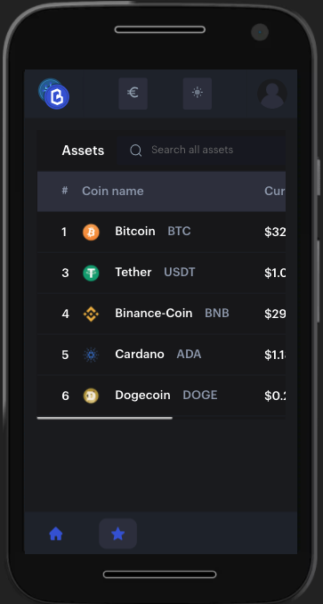

<div align="center">
  
</div>

> In CyrptoStatus you can view, save as favorites and see the details of a lot of cryptocurrencies.

### [APP in Vercel](https://cryptostatus.vercel.app)

**Table of contents**

- [Features](#features)
- [Project code](#project-code-👨‍💻)
- [Screenshots](#screenshots)
  - [Desktop](#desktop)
  - [Mobile](#mobile)
- [Extra](#extra)
  - [Built with](#built-with)
  - [Commitlint](#commitlint)
  - [Quick start](#quick-start)
- [Links](#links)
- [Author](#author)


# Features

To obtain the raw data, you will be able to use Coincap, an open data API that provides lots of info about crypto: https://docs.coincap.io/


Features | Status |
:------------ | :-------------|
A page that displays all cryptos available in the API (for example using rows or tiles). Include at least for each crypto the name and symbol | ✅ |
When user clicks on a crypto should navigate to a new page displaying more info of the crypto, including at least name and symbol, market cap and last price in USD | ✅ |  |
Basic layer of tests that I consider important | ✅ |
Graph to the crypto page with historic prices | ✅ |
In the crypto page also display the price in Euros | ✅ |
Caching | ✅ |
Check and uncheck coins as favorites to view it in a favorites view | ✅ |
Select date ranges to display on the graph | ✅ |
Switching between dark and light themes | ✅ | 
Asset finder | ✅ |
Use `new WebSocket("wss://ws.coincap.io/prices?assets=${assets}\")` for Realtime prices | ❌ |
Continuous Deployment | ✅ |
Responsive | ✅ |
Image asset | ✅ |

# Project code 👨‍💻

This project has been developed with **NuxtJS**. My main experience in a framework is with Vue, that's why I decided to use NuxtJS (an open framework based on Vue inspired by NextJS). Also, I think that for an application that would be used by any user and would be public to the internet, SSR applications are better for SEO since it makes it easier for Google's robot to read.

**Vuex**

I like use a Flux architecture.

**Middleware**

Middleware allows you to define custom functions that can be executed before a page or group of pages (layout) is displayed. I created one to check if the user is visiting the site from a mobile device, and if so show a different layout.

**Local Storage**

To save the theme, currency and favorites data I use localStorage. Maybe I could have used indexDB since it is a better optimized browser database than localStorage (Web Storage) but since the data are few and it is less complex, I decided to store it here.

# Screenshots

## Desktop


## Mobile


# Extra

## Commitlint

This project follows the [commitlint](https://github.com/conventional-changelog/commitlint) guidelines.
## Built with

- Semantic HTML5 markup
- CSS custom properties
- Flexbox
- CSS Grid
- Utility classes
- Eslint
- [NuxtJS](https://nuxtjs.org/) - Framework
- [Vue Jest](https://vue-test-utils.vuejs.org/installation/) - Testing Library
- [Lightweight Charts](https://github.com/tradingview/lightweight-charts) -  Library for Graph

## Quick start

```bash
$ git clone git@gitlab.com:cristianpoleyjs/cryptostatus.git
$ cd cryptostatus/

# install dependencies (It is recommended to use the latest LTS version)
$ npm install

# serve with hot reload at localhost:3000
$ npm run dev

# build for production and launch server
$ npm run build
$ npm run start

# generate static project
$ npm run generate
```

## Links

- Solution URL: [APP Code](https://github.com/cristianpoleyjs/cryptostatus)
- Live Site URL: [APP in Vercel](https://cryptostatus.vercel.app/)

## Author

- Website - [Cristian Poley](https://www.cristianpoley.com)
- GitHub - [cristianpoleyJS](https://github.com/cristianpoleyJS)
