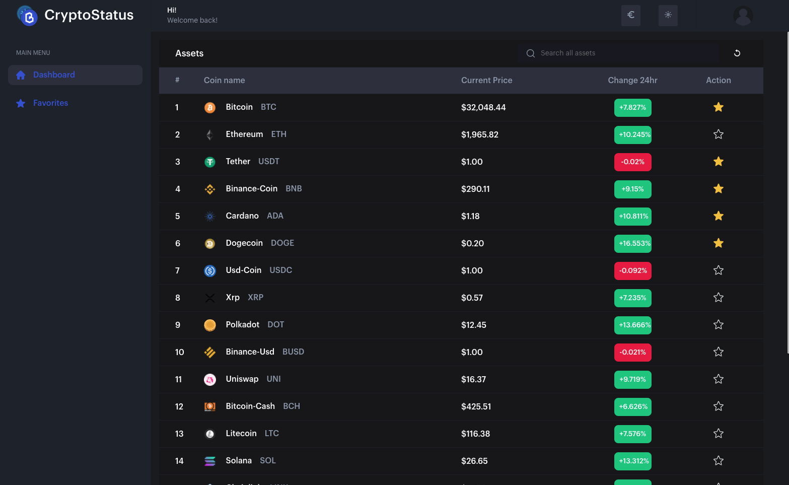

<div align="center">
  
  <h1>CryptoNine - Frontend Challenge</h1>
</div>

> CryptoNine is a specific solution for code testing presented by Ninety Nine for the position of Senior Frontend Engineer.

### [APP in Vercel](https://cryptonine.vercel.app)

**Table of contents**

- [Features](#features)
- [Project code](#project-code-👨%E2%80%8D💻)
- [Screenshots](#screenshots)
  - [Desktop](#desktop)
  - [Mobile](#mobile)
- [Extra](#extra)
  - [Built with](#built-with)
  - [Commitlint](#commitlint)
  - [Quick start](#quick-start)
- [Links](#links)
- [Author](#author)


# Features

Create a simple flow for users to navigate and see information of Cryptocurrencies.

To obtain the raw data, you will be able to use Coincap, an open data API that provides lots of info about crypto: https://docs.coincap.io/


Features | Status | Observation |
:------------ | :-------------| :-------------|
A page that displays all cryptos available in the API (for example using rows or tiles). Include at least for each crypto the name and symbol. You can create a backend service from where to query the API, or just get the info directly from the front end| ✅ |  |
When user clicks on a crypto should navigate to a new page displaying more info of the crypto, including at least name and symbol, market cap and last price in USD | ✅ |  |
Add a basic layer of tests you would consider important (no need to be comprehensive, we just want to understand how you would structure them) | ✅ | I have added some tests for components and store. Although I have not been able to finish them all, I think there is variety. I would have liked to add Cypress for e2e since I have more experience than with unit tests |
Add a graph to the crypto page with historic prices | ✅ |  |
In the crypto page also display the price in Euros | ✅ |  |
Add caching | ✅ | I use localStorage to save favorites, theme and currency  |
Check and uncheck coins as favorites to view it in a favorites view | ✅ |  🆕 |
Select date ranges to display on the graph | ✅ |  🆕 |
Switching between dark and light themes | ✅ |  🆕 |
Asset finder | ✅ |  🆕 |
Use `new WebSocket("wss://ws.coincap.io/prices?assets=${assets}\")` for Realtime prices | ❌ |  🆕&nbsp;&nbsp; I would have done it in the Asset detail view, so that even the graph is updated in real time, but I didn't have time|
Continuous Deployment | ✅ | 🆕&nbsp;&nbsp; I use Vercel as hosting, and I have hooks configured on the main branches to run a deployment pipeline |
Responsive | ✅ | 🆕&nbsp;&nbsp; I have developed a different layout for when accessed directly from the mobile |

# Project code 👨‍💻

This project has been developed with **NuxtJS**. My main experience in a framework is with Vue, that's why I decided to use NuxtJS (an open framework based on Vue inspired by NextJS). Also, I think that for an application that would be used by any user and would be public to the internet, SSR applications are better for SEO since it makes it easier for Google's crawler to read.

**Vuex**

I initialize and use store to show my knowledge in a Flux architecture.

**Middleware**

Middleware allows you to define custom functions that can be executed before a page or group of pages (layout) is displayed. I created one to check if the user is visiting the site from a mobile device, and if so show a different layout.

**Local Storage**

To save the theme, currency and favorites data I use localStorage. Maybe I could have used indexDB since it is a better optimized browser database than localStorage (Web Storage) but since the data are few and it is less complex, I decided to store it here.

# Screenshots

## Desktop


## Mobile


# Extra

## Commitlint

This project follows the [commitlint](https://github.com/conventional-changelog/commitlint) guidelines.
## Built with

- Semantic HTML5 markup
- CSS custom properties
- Flexbox
- CSS Grid
- Eslint
- [NuxtJS](https://nuxtjs.org/) - Framework
- [Vue Jest](https://vue-test-utils.vuejs.org/installation/) - Testing Library
- [Lightweight Charts](https://github.com/tradingview/lightweight-charts) -  Library for Graph

## Quick start

```bash
$ git clone git@gitlab.com:cristianpoleyjs/cryptonine.git
$ cd cryptonine/

# install dependencies (It is recommended to use the latest LTS version)
$ npm install

# serve with hot reload at localhost:3000
$ npm run dev

# build for production and launch server
$ npm run build
$ npm run start

# generate static project
$ npm run generate
```

## Links

- Solution URL: [APP Code](https://gitlab.com/cristianpoleyjs/cryptonine)
- Live Site URL: [APP in Vercel](https://cryptonine.vercel.app/)

## Author

- Website - [Cristian Poley](https://www.cristianpoley.com)
- GitHub - [cristianpoleyJS](https://github.com/cristianpoleyJS)
